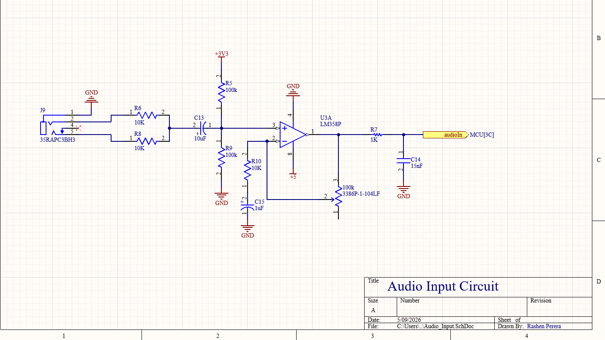
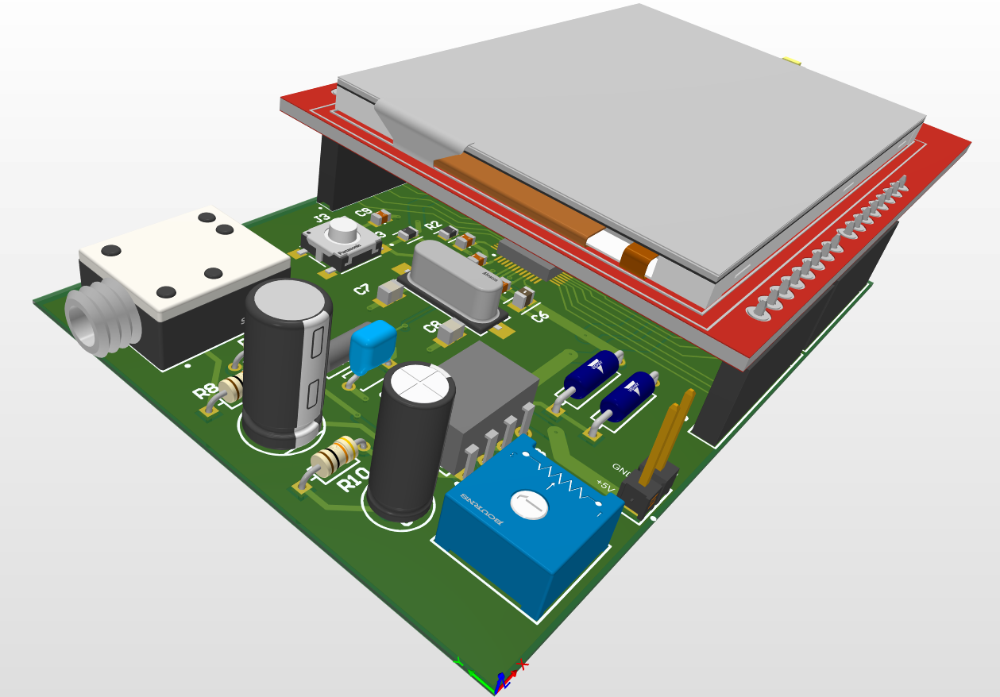
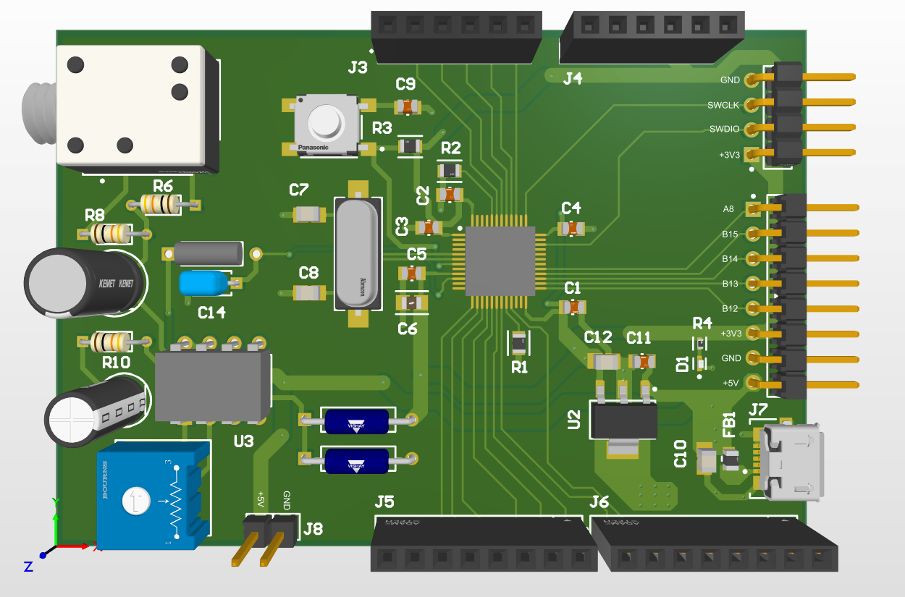
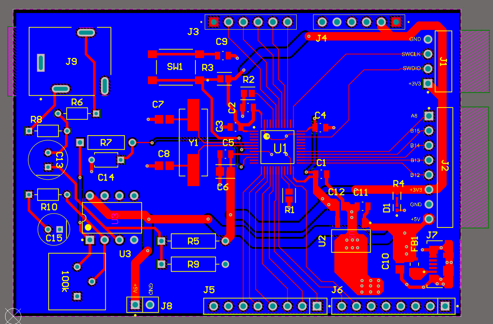

# STM32 Audio Spectrum Analyzer

*Firmware and Hardware design files for a real-time, 64-band audio spectrum analyzer built from the ground up.*

## Overview
This project processes audio signals in real-time using an STM32 microcontroller and the ARM CMSIS-DSP library. It captures audio via a custom analog front-end, computes a 512-point FFT, and drives an ILI9341 display over a high-speed 8-bit parallel bus.

## Tech Stack
* **Microcontroller:** STM32F1 series
* **DSP:** ARM CMSIS-DSP (Fast Fourier Transform)
* **Display:** 2.4" tft lcd shield (ILI9341) 

## Hardware Setup & Wiring

### 1. ILI9341 Display Pinout (8-Bit Parallel)
To achieve high framerates for the spectrum analyzer, the display is driven using an 8-bit parallel interface rather than standard SPI. 

**Important Hardware Notes:**
* **VCC:** Must be connected to **3.3V** (Connecting to 5V may damage the logic levels unless your specific display module has a built-in 5V-to-3.3V regulator).
* **LCD_RD (Read Pin):** Since the firmware operates in write-only mode to maximize speed, the `RD` pin must be permanently tied to **3.3V (HIGH)** to disable reading and prevent bus collisions.

| ILI9341 Pin | STM32F1 Pin | Description |
| :--- | :--- | :--- |
| **VCC** | 3.3V | Power Supply |
| **GND** | GND | Ground |
| **CS** | PB14 | Chip Select |
| **RST** | PB15 | Reset |
| **DC / RS** | PB13 | Data / Command |
| **WR** | PB12 | Write Strobe |
| **RD** | 3.3V | Read Strobe (Tied HIGH) |
| **D0** | PA9 | Data Bit 0 |
| **D1** | PA8 | Data Bit 1 |
| **D2** | PB4 | Data Bit 2 |
| **D3** | PB3 | Data Bit 3 |
| **D4** | PA15 | Data Bit 4 |
| **D5** | PA12 | Data Bit 5 |
| **D6** | PA11 | Data Bit 6 |
| **D7** | PA10 | Data Bit 7 |

---

### 2. Custom Analog Front-End (Audio Input)
To properly read the AC audio signal with the STM32's internal ADC, the signal must be amplified and shifted above the 0V ground plane. 

The custom analog front-end uses an **LM358 Op-Amp** to accomplish three things:
1. **Stereo to Mono Summing:** Resistors R6 and R8 safely sum the Left and Right audio channels into a single mono signal.
2. **DC Bias:** The voltage divider network creates a 1.65V DC offset, allowing the AC audio wave to oscillate safely within the STM32's 0V - 3.3V ADC window.
3. **Anti-Aliasing Filter:** An RC low-pass filter (R7, C14)cut-off high-frequency noise above ~10.6kHz to prevent aliasing in the FFT calculations.

## Hardware Design (Altium Designer)
The custom mixed-signal PCB was designed in Altium Designer. It features an isolated analog front-end for the audio input, a dedicated 8-bit parallel bus for the ILI9341 display.

### 3D Renders

### 2D Routing

